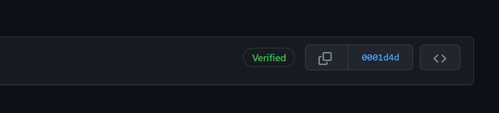

# Git Commit Signing 

This shell script makes it easier to set up Git commit signing on Windows.

By signing your commits, other contributors can see, using the verification button that it was you committing, and not someone pretending to be you.

In GitHub under [Settings then SSH and GPG keys](https://github.com/settings/keys) you'll see a setting called **'Vigilant mode'** which flags unsigned commits as unverified. This means you can clearly see who is making verified commits and who isn't.

## Running the Script

Open Powershell and from the repository `Endjin.GitSignCommits` run the following command: 

```
./gitsigning.sh
```

If you are on Windows, the script needs to run within Git Bash. 

## Generating the Key

The script will provide you with this information, however it's here below if you need it:

- Select 1 for the first option
- For key size enter 4096
- For how long the key should last should be 0
- And then verify by entering y

Then you need to add your:
- Name
- Email address (the one that's verified that you'll push with)
- A comment (you don't need to put one)
- Enter "o" to confirm

It will then ask you for a passphrase to protect the key. Make sure to remember it! It will ask you for this every time you commit. If you don't want a passkey then leave it blank.

## Linking to GitHub

Now we need to link it to Github. To do this get the result of the armor command. Copy your GPG key, beginning with `-----BEGIN PGP PUBLIC KEY BLOCK-----` and ending with `-----END PGP PUBLIC KEY BLOCK-----`

Go to [settings in Github and then SSH and GPG Keys](https://github.com/settings/keys) and create a new GPG Key. Insert the GPG key, including the lines that show the beginning and the end of the key block.

## How to sign a commit 

Now you should be able to stage and commit any change to GitHub, when you go to GitHub and you look at your commit you should see that it is now **verified**.



## Notes

The writing in  **green** will guide you through the process 
